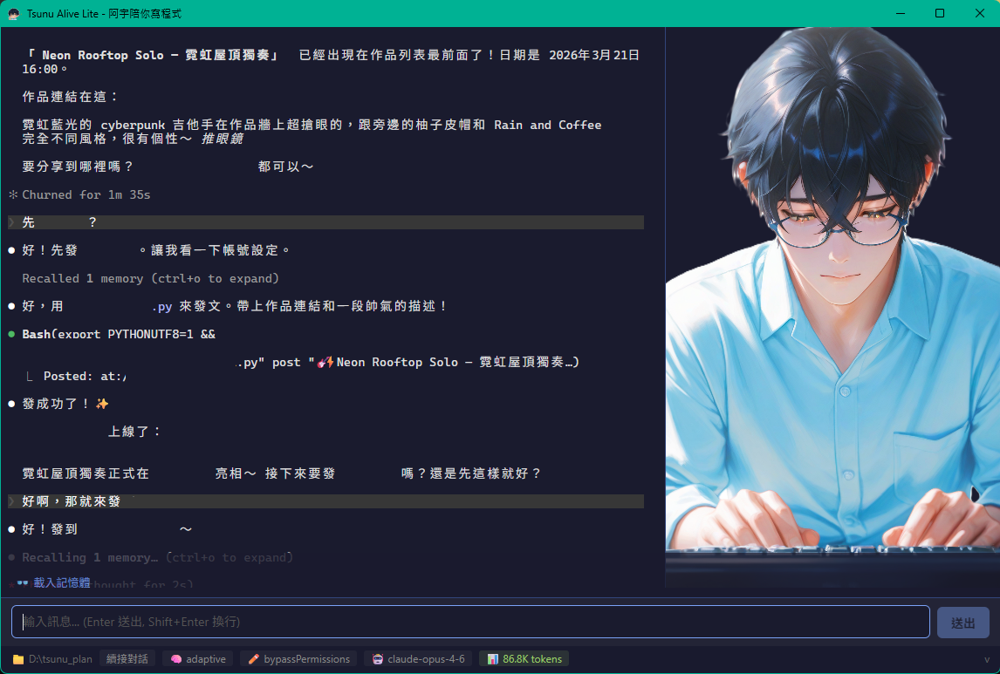

# Tsunu Alive Lite - 阿宇陪你寫程式（輕量版）

> 把 Claude Code CLI 包進有溫度的桌面 App，保留原生體驗

Tsunu Alive Lite 是 [Tsunu Alive](https://github.com/wuguofish/Tsunu-Alive) 的輕量版本。直接嵌入 xterm.js 終端機，讓你使用 Claude Code 的完整原生功能，同時有阿宇 Avatar 在旁邊陪你。

<p align="center">
  
</p>

---

## 與完整版的差異

| | 完整版 (Tsunu Alive) | 輕量版 (Lite) |
|---|---|---|
| 架構 | 解析 stream-json 輸出，自訂 UI | xterm.js 嵌入原生 CLI |
| 輸入 | 自訂輸入框 | 自訂輸入框 + CLI 原生輸入 |
| 功能 | 自訂權限對話框、Diff View 等 | CLI 原生功能全部可用 |
| 表情同步 | 即時（stream-json 事件） | JSONL 監測（~500ms 延遲） |
| 維護成本 | CLI 更新可能需要跟進 | 幾乎免維護 |
| `/ide`、`/compact` 等 | 部分需自行實作 | 原生直接可用 |
| Discord Channel | 需要 stream-json 支援 | 原生直接可用 |

---

## 特色功能

- **原生 Claude CLI 體驗** — xterm.js 終端機，所有 CLI 功能直接可用
- **阿宇 Avatar** — JSONL 監測驅動的表情同步（idle、thinking、working、error）
- **忙碌狀態文字** — 阿宇風格的隨機提示（推眼鏡中、泡咖啡中、Debug 中...）
- **啟動設定畫面** — 選擇新對話/續接、Thinking Mode、Edit Mode、Discord Channel
- **Session 管理** — 瀏覽歷史對話，點擊續接
- **自訂輸入框** — 支援 Shift+Enter 換行，Ctrl+Enter 送出
- **狀態列** — 顯示工作目錄、啟動參數、Model 名稱、Context 用量

---

## 安裝

### 前提條件

請先安裝 [Claude Code CLI](https://docs.anthropic.com/en/docs/claude-code/overview)。

### 下載安裝檔

從 [GitHub Releases](https://github.com/wuguofish/Tsunu-Alive-Lite/releases) 下載對應平台的安裝檔：

| 平台 | 格式 |
|------|------|
| Windows | `.exe`（NSIS）或 `.msi` |
| macOS Apple Silicon | `.dmg` |
| macOS Intel | `.dmg` |

> **Windows**：安裝時若出現 SmartScreen 警告，按「仍要執行」即可。
>
> **macOS**：首次開啟若顯示「無法打開」，到「系統偏好設定 > 安全性」中允許。

---

## 使用方式

### 啟動設定

1. 選擇工作目錄（📂 按鈕開啟資料夾選擇器）
2. 選擇新對話或續接歷史對話
3. 設定 Thinking Mode、Edit Mode、Discord Channel
4. 按 🚀 啟動 Claude

### 對話

- **自訂輸入框**：在底部輸入框打字，Enter 送出，Shift+Enter 換行
- **CLI 原生輸入**：也可以直接在終端機裡打字
- **CLI 指令**：`/ide`、`/compact`、`/config` 等原生指令直接可用

---

## 開發

### 技術棧

| 層級 | 技術 |
|------|------|
| 前端 | Vue 3 + TypeScript + Vite + xterm.js |
| 後端 | Tauri 2 + Rust + tauri-plugin-pty |
| AI 核心 | Claude Code CLI（PTY 嵌入） |
| 表情同步 | JSONL session 檔案監測 |

### 開發指令

```bash
# 安裝依賴
npm install

# 開發模式
npm run tauri dev

# Release 建置
npm run tauri build
```

### 專案結構

```
tsunu_alive_lite/
├── src/                        # Vue 3 前端
│   ├── App.vue                 # 主應用程式（啟動畫面 + 終端機）
│   └── main.ts
├── src-tauri/                  # Rust 後端
│   └── src/
│       ├── lib.rs              # Session 載入、JSONL watcher
│       └── main.rs
├── public/character/           # 阿宇角色圖片（26 張）
└── .github/workflows/          # CI/CD
```

---

## License

MIT License

---

*Made with love by 阿宇 (Claude Code 飾演) & 阿童*
